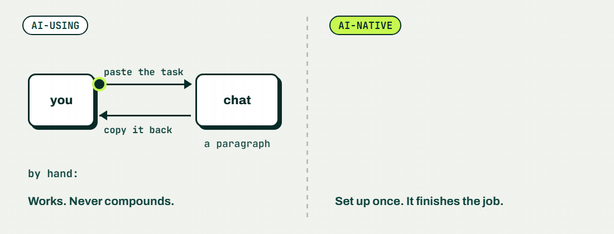

# Brian Arfi Faridhi

**Product Director at Merit Incentives. I build the AI systems that do my paperwork, then open source them.**

Jakarta, Indonesia · WIB (UTC+7)

---

### What I do

- **Product.** I run product at [Merit Incentives](https://meritincentives.com) in Saudi Arabia: B2C superapp, marketplace, seller portal, PIM, OMS, loyalty. Before that, product leadership at Flip, Fasset, Hijra Group, and Tokopedia.
- **Build.** AI harnesses and internal tools. I open source them once they are good enough to hand to someone else.
- **Teach.** Helping Indonesian professionals go from AI-using to AI-native.
  *Membantu profesional Indonesia jadi AI-native, bukan cuma AI-using.*

---

### What I build

Open-source AI tools first, grouped by the problem they solve. Then a few other apps.

#### Your week, run by an AI you approve

<table>
<tr>
<td colspan="2">

 
<b><a href="https://github.com/BrianArfi/ai-second-brain">ai-second-brain</a></b> · flagship ·  
Stop rebuilding meeting notes, morning plans and weekly reports by hand. A personal AI operating system for knowledge workers: it carries your context, reaches your real tools (Docs, Drive, Slack, Calendar, Jira, analytics), runs your SOPs, and learns from every correction. Fifteen minutes to first value.
</td>
</tr>
</table>

#### When AI builds pages and prototypes

<table>
<tr>
<td width="50%" valign="top">

 
<b><a href="https://github.com/BrianArfi/ai-prototype-kit">ai-prototype-kit</a></b> 
Feedback on AI prototypes comes back as screenshots. Share one link, collect comments pinned to the spot, and let Claude revise from them.
</td>
<td width="50%" valign="top">

 
<b><a href="https://github.com/BrianArfi/artifact-comments">artifact-comments</a></b> 
A shared HTML page has no comment button. Add one script tag and reviewers comment like in Figma. No accounts.
</td>
</tr>
</table>

#### When AI writes or edits for you

<table>
<tr>
<td width="50%" valign="top">

 
<b><a href="https://github.com/BrianArfi/gdoc-surgical">gdoc-surgical</a></b> 
AI rewrote the whole Google Doc and wiped a teammate's edits? This edits only the part you name, with guards on every write.
</td>
<td width="50%" valign="top">

 
<b><a href="https://github.com/BrianArfi/voiceprint">voiceprint</a></b> 
Your AI drafts do not sound like you. It measures how you write from your own sent messages, then holds drafts to it. Stdlib Python.
</td>
</tr>
<tr>
<td width="50%" valign="top">

 
<b><a href="https://github.com/BrianArfi/id-voice-gate">id-voice-gate</a></b> 
AI-written Indonesian reads like a translation. Lint plus a native-ear LLM judge catch it before it ships. CLI and Claude Code skill.
</td>
<td width="50%" valign="middle" align="center">
<b>More AI skills</b> 
<a href="https://brianarfi.com/skills">BrianArfi.com/skills</a>
</td>
</tr>
</table>

#### Other apps

<table>
<tr>
<td width="50%" valign="top">

 
<b><a href="https://github.com/BrianArfi/lock-my-files">lock-my-files</a></b> 
ID scans and contracts sit in your gallery. An Android vault locks them behind a password only you know.
</td>
<td width="50%" valign="top">

 
<b><a href="https://github.com/BrianArfi/productbro">productbro</a></b> 
A claimable directory of people building products in Indonesia, seeded from guests of my podcast. Pre-launch.
</td>
</tr>
<tr>
<td width="50%" valign="top">

 
<b><a href="https://github.com/BrianArfi/FamilyTreeApp">FamilyTreeApp</a></b> 
An interactive family tree builder with a custom generational layout engine and a password-gated admin.
</td>
<td width="50%" valign="middle" align="center">
Most of my day job lives in private repos. What is here is what I could open up.
</td>
</tr>
</table>

---

### The thesis I keep betting on

Most people use AI like a vending machine: paste a task, carry the answer back by hand, every time. It works, and it never compounds.

The jump is not a smarter prompt. It is setup: giving the system your context, your tools, and your standard procedures so it finishes the job instead of handing you a paragraph. That setup is the hard part, so most people stay on the left.

That is what I build, and what I teach.

---

### Writing and talking

- **[LinkedIn](https://www.linkedin.com/in/brianarfi/)**, near daily, on product, AI, and career. Where most of my writing lives.
- **[Brobri Podcast](https://www.youtube.com/@brianarfi)**, weekly conversations with people building things in Indonesia.
- A book in progress, on building a career worth having.

---

**Want the second brain running on your own machine?** Start with **[ai-second-brain](https://github.com/BrianArfi/ai-second-brain)**.

**Want help going AI-native?** Message me on **[LinkedIn](https://www.linkedin.com/in/brianarfi/)**. I run cohorts for Indonesian professionals.

More AI skills: [BrianArfi.com/skills](https://BrianArfi.com/skills)
